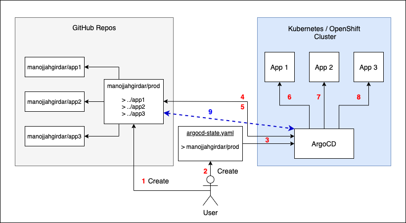
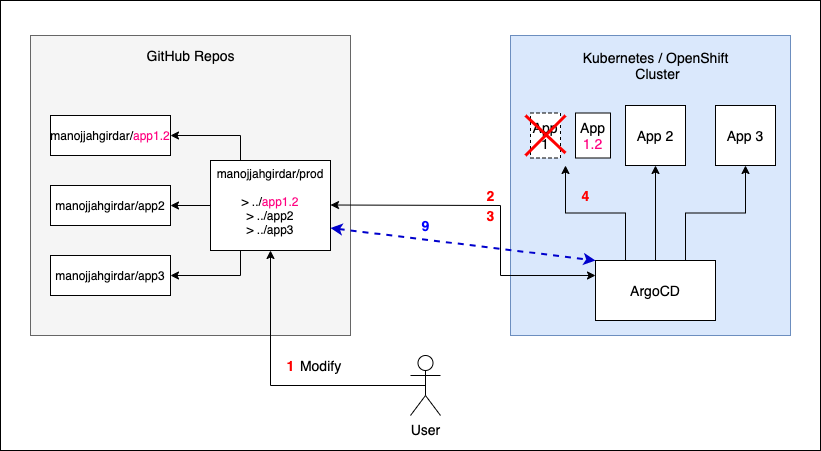

# Digital Developer Conference Hybrid Cloud 2021 - Getting Started with ArgoCD on OpenShift
Register for free and get ready to build smart and secure applications on hybrid cloud with agility, flexibility, and portability. Register [here](https://developer.ibm.com/conferences/digital-developer-conference-hybrid-cloud/).

In this session, you will learn GitOps principles, How to install Red Hat OpenShift GitOps on your OpenShift cluster, Learn ArgoCD Console and CLI.

#### ArgoCD - 
ArgoCD is a deployment mechanism based on GitOps principles and designed for Kubernetes/OpenShift.

### Basic Understanding

**Figure 1:** Basic Workflow

Argo CD is implemented as a Kubernetes controller which continuously monitors running applications and compares the current, live state against the desired target state (as specified in the Git repo). A deployed application whose live state deviates from the target state is considered OutOfSync. Argo CD reports & visualizes the differences, while providing facilities to automatically or manually sync the live state back to the desired target state. Any modifications made to the desired target state in the Git repo can be automatically applied and reflected in the specified target environments.

**Figure 2:** Automatic/Manual state Sync

